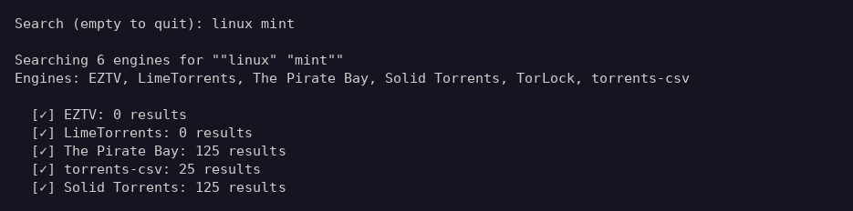
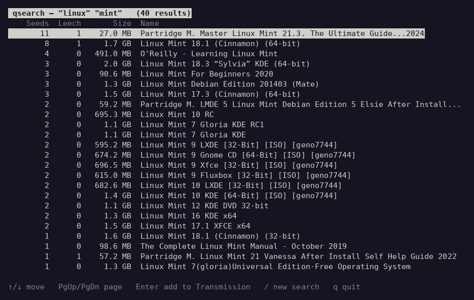
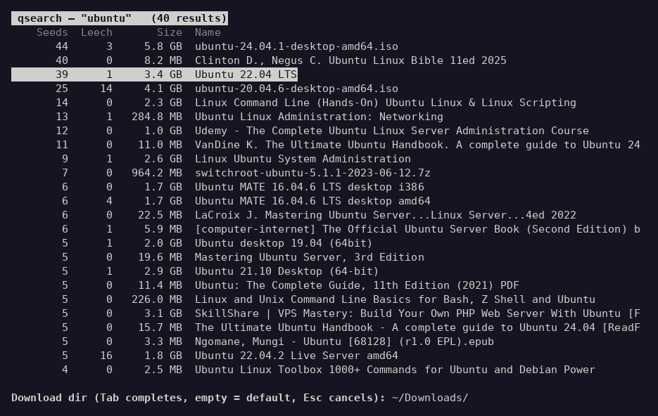
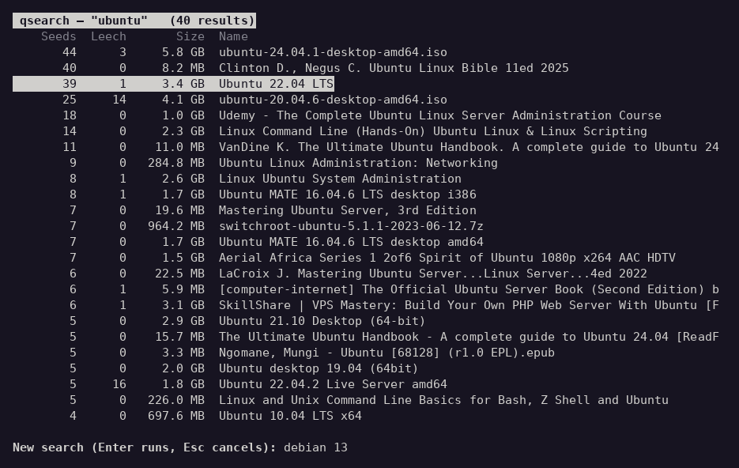

# qbitsearch

A command-line tool that searches multiple torrent sites simultaneously using
[qBittorrent search plugins](https://github.com/qbittorrent/search-plugins),
with an interactive picker that sends results straight to
[Transmission](https://transmissionbt.com/).

**Version 2.0**

## Screenshots

Run with no arguments and just type a search:



Results open in an interactive picker — browse, then press Enter to send a
torrent to Transmission:



Pick a download directory with tab completion (your last choice is remembered):



Press `/` to run a new search without leaving the picker:



## Features

- Searches 6 engines concurrently: EZTV, LimeTorrents, The Pirate Bay, Solid Torrents, TorLock, torrents-csv
- **Interactive TUI picker** — browse results and add them to Transmission with one keypress
- **No-arguments mode** — run `python qsearch.py` and type your search at a prompt
- **Search again from the picker** — press `/` to enter a new query without restarting
- Download-directory prompt with tab completion; last-used directory is remembered across runs
- Deduplicates results by info hash
- Sorts results by seeders (or by date with `-r`)
- Filter results to recent releases with `-r`
- Optionally saves results to a `.txt` file with `-f`
- Plain text output with `-p` (automatic when piped) for scripting
- No third-party Python dependencies — standard library only

## Requirements

- Python 3.10+
- `transmission-remote` in PATH for the picker's add-to-Transmission feature
  (Debian/Ubuntu: `sudo apt install transmission-cli`) — searching and text
  output work without it

## Installation

```sh
git clone https://github.com/Mcm190/qbitsearch.git
cd qbitsearch
python qsearch.py --update-engines
```

## Usage

```sh
python qsearch.py                    # interactive: prompts for a search
python qsearch.py [TERMS...] [OPTIONS]
```

| Argument | Description |
|---|---|
| `TERMS` | One or more search terms, joined into a single query |

| Flag | Default | Description |
|---|---|---|
| `-n N`, `--count N` | `40` | Show top N results sorted by seeders |
| `-r DURATION`, `--recent DURATION` | off | Only show results released within a time window |
| `-f`, `--file` | off | Also write results to a dated `.txt` file |
| `-p`, `--plain` | off | Print results as text instead of the interactive picker |
| `-t N`, `--timeout N` | `15` (`40` with `-r`) | Seconds to wait for slow engines |
| `--version` | — | Show version and exit |
| `--update-engines` | — | Re-download all official engine plugins and exit |
| `--list-engines` | — | List available engine plugins and exit |

### Interactive picker keys

| Key | Action |
|---|---|
| `↑`/`↓`, `j`/`k` | Move selection |
| `PgUp`/`PgDn`, `g`/`G` | Page / jump to top or bottom |
| `Enter` | Add selected torrent to Transmission |
| `/` | Type a new search and rerun without quitting |
| `q` / `Esc` | Quit |

### Duration format for `-r`

| Suffix | Unit |
|---|---|
| `m` | minutes |
| `h` | hours |
| `d` | days |
| `w` | weeks |

Examples: `2h`, `7d`, `2w`, `90m`

Results with no date information are excluded when `-r` is used.

## Examples

```sh
# No arguments: prompts for a search, results open in the picker
python qsearch.py

# Basic search
python qsearch.py "breaking bad"

# Multiple terms joined into one query
python qsearch.py "the boys" "s03e01"

# Top 5 results from the last 3 days
python qsearch.py "the boys" -n 5 -r 3d

# Last week's releases, saved to file
python qsearch.py "house of the dragon" -r 1w -f

# Plain text output (for piping/scripting)
python qsearch.py ubuntu -p

# Show available engines
python qsearch.py --list-engines

# Update engine plugins from qbittorrent/search-plugins
python qsearch.py --update-engines
```

See [USAGE.md](USAGE.md) for full documentation.

## Changelog

### 2.0

- Interactive curses picker: results open in a browsable list; Enter adds the
  selected torrent to Transmission via `transmission-remote`, with a
  tab-completing download-directory prompt (last directory remembered)
- Run with no arguments to get an interactive search prompt
- Press `/` in the picker to run a new search without restarting
- Default result count raised from 20 to 40
- `-p/--plain` flag for the old text output (automatic when piped)
- `-t/--timeout` flag to control per-engine wait time
- `--version` flag

### 1.0

- Concurrent multi-engine search with deduplication, seeder/date sorting,
  recency filter, and text/file output
